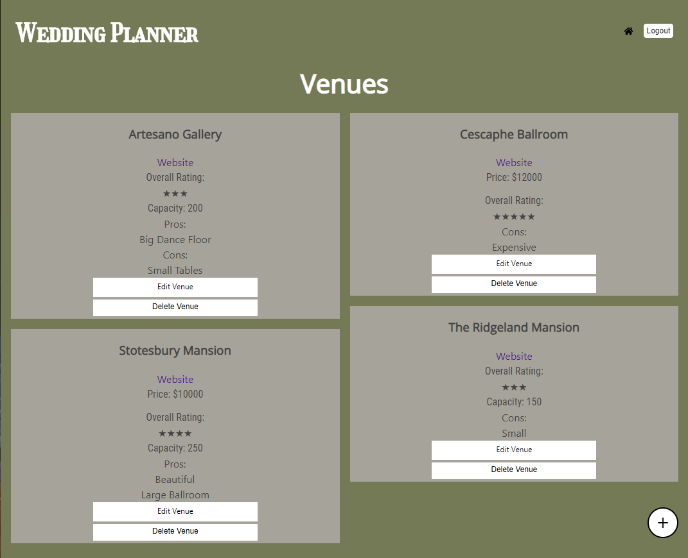

## Wedding Planner

Here is the link to the [live app](https://kclynch94-wedding-planner.now.sh/).

## Summary

This app is designed to help people plan there weddings. With tons of options out there for each piece of a wedding it be hard to pick the right one and even keep track of all the options. Wedding planner allows you to log your favorites and compare them.

## API Endpoints

The base URL of the API is https://aqueous-peak-74784.herokuapp.com/api

This API is authenticated so only users with a valid credentials will be able to access it.

This API has endpoints for the following:
* /venues
* /photographers
* /guests
* /caterers
* /florists
* /auth
* /users

All of the endpoints have CRUD operations

## Technology Used

* React
* CSS
* Node
* Express
* PostgreSQL
